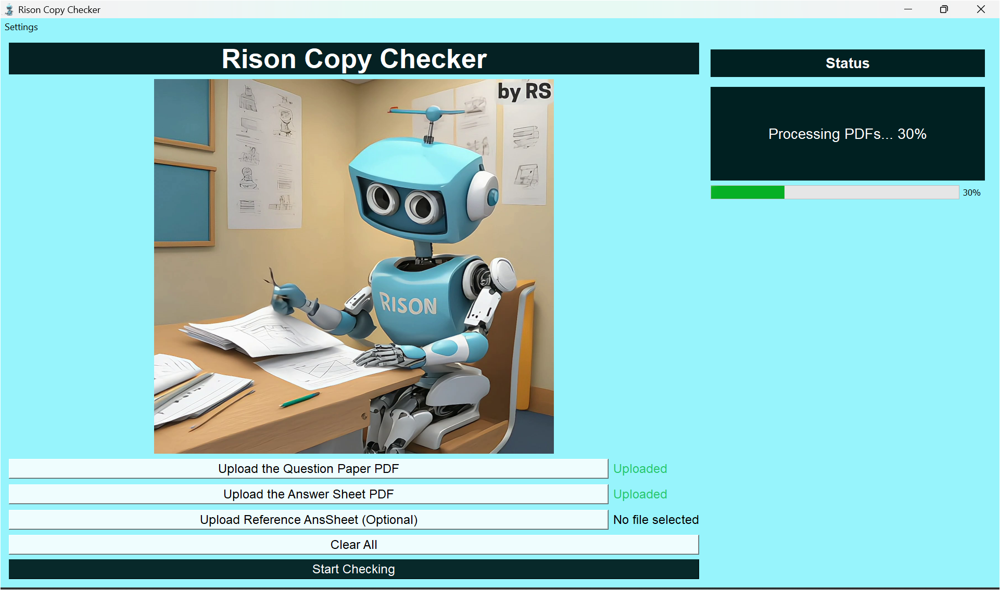

# Rison-Copy-Checker

## Project Description

**Rison-Copy-Checker** is a Python-based desktop application designed to automatically evaluate university exam answer sheets. The application uses a GUI where users can upload a PDF of the question paper, the answer sheet, and optionally a reference marking scheme. The project uses the Google Gemini API (Flash 1.5 model) to analyze the answer sheet and provide a detailed report with correctness, marks, and analysis for each question.

## Installation Instructions

### Prerequisites

Before you begin, ensure you have Python 3.x installed on your machine. Additionally, you will need to install the required dependencies.

### Step 1: Clone the repository

Clone this repository to your local machine using the following command:

```
git clone https://github.com/rishb0/Rison-Copy-Checker.git
```

### Step 2: Install dependencies

Navigate to the project folder and install the required Python modules using the `install-dependencies.bat` script:

1. **Run `install-dependencies.bat`** by double-clicking it or running it from the command prompt. This will automatically install the necessary modules listed in `requirements.txt`.
   
Alternatively, you can manually install the dependencies by running the following command:

```
pip install -r attached_assets/requirements.txt
```

### Step 3: API Key

To use the Gemini API, you need an API key. Replace the existing API key in the code with your own key or set it as an environment variable named "GEMINI_API_KEY".

To get the API-KEY visit : https://aistudio.google.com/apikey

## Usage

1. Ensure your machine is connected to the internet.
2. Run the application by executing one of the following commands:

```
python RisonCC.py
```

Or use the alternative entry point:

```
python run_app.py
```

3. The GUI will open. Upload the **question paper PDF**, **answer sheet PDF**, and optionally a **reference marking scheme**.
4. Click on **Start Checking**. The program will analyze the answer sheet and generate a report with correctness, marks, and detailed analysis for each question.
5. The time taken for the analysis will depend on the size of the PDF files and the speed of your internet connection.

> **Note**: If you encounter import errors with the main script, try using `run_app.py` which includes additional path configuration to handle import issues.

## Project Structure

The project has been organized into the following structure:

```
Rison-Copy-Checker/
│
├── RisonCC.py                  # Main application entry point
├── run_app.py                  # Alternative entry point with path configuration
│
├── src/                        # Source code directory
│   ├── __init__.py             # Package initialization
│   │
│   ├── ui/                     # User interface components
│   │   ├── __init__.py         # UI package initialization
│   │   ├── main_window.py      # Main application window
│   │   ├── prompts.py          # Prompt generation for the AI
│   │   └── report_generator.py # Report generation (Markdown format)
│   │
│   └── utils/                  # Utility functions
│       ├── __init__.py         # Utils package initialization
│       └── pdf_processor.py    # PDF processing and Gemini API integration
│
├── create_project_zip.py       # Script for packaging the project for distribution
│
├── attached_assets/            # Asset files for the application
│   ├── requirements.txt        # Python dependencies
│   ├── HDRobotVideo.mp4        # Robot animation video
│   ├── rison icon.ico          # Application icon
│   └── install-dependencies.bat # Installation script
```

## Workflow and Data Flow

The application follows this workflow:

1. **User Interface Layer** (`src/ui/main_window.py`):
   - Displays the GUI and handles user interactions
   - Manages file uploads through file dialogs
   - Initiates the processing thread when "Start Checking" is clicked
   - Animates the robot video during processing as a visual indicator
   - Displays progress and results to the user

2. **Processing Layer** (`src/utils/pdf_processor.py`):
   - Converts uploaded PDFs to images
   - Encodes images as base64 strings
   - Constructs prompts for the Gemini API
   - Sends the data to Google's API and retrieves the response
   - Handles temporary file management
   
3. **Prompt Construction** (`src/ui/prompts.py`):
   - Generates specialized prompts based on the uploaded files
   - Adapts prompts depending on whether a reference answer sheet is provided

4. **Report Generation** (`src/ui/report_generator.py`):
   - Creates a formatted Markdown report from the Gemini API response
   - Automatically saves the report with a timestamp
   - Provides an option to open the report immediately

5. **Threading Model**:
   - Processing happens in a background thread to prevent UI freezing
   - Progress updates are communicated via Qt signals and slots
   - The UI remains responsive during the potentially lengthy API calls
   
6. **Data Flow**:
   - PDFs → Images → Base64 Encoding → Gemini API → Text Response → Markdown Report

## License

This project uses the **Gemini API** for analysis, which requires an API key. As this API is free to use, there is no additional licensing required for the project itself.

## Contact

For any inquiries or issues, please feel free to reach out via GitHub: [@rishb0](https://github.com/rishb0).

## Screenshots

